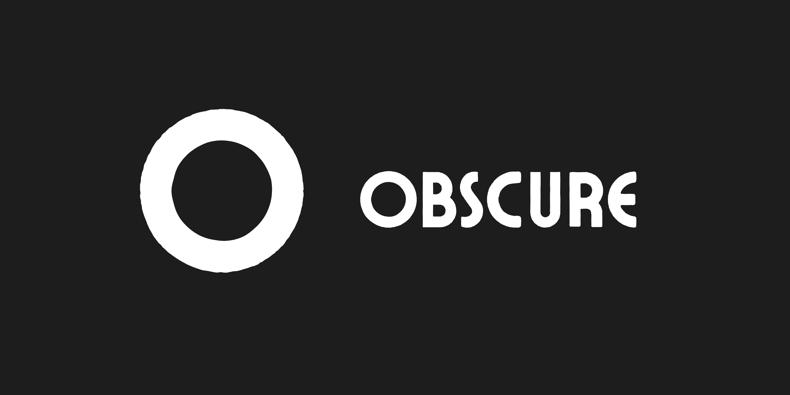

# Obscure



A secure, encrypted backup tool that supports multiple cloud storage providers. Obscure allows you to create encrypted backups of your data and store them in your own cloud storage buckets (BYOB - Bring Your Own Bucket).

## Features

- 🔐 **End-to-End Encryption**: All backups are encrypted using AES-GCM before being uploaded
- ☁️ **Multiple Cloud Providers**: Support for Amazon S3, Google Cloud Storage, Backblaze B2, IDrive E2, and S3-compatible services, and Filebase + IPFS (decentralized storage)
- 🔄 **Version Control**: Tag and version your backups for easy organization
- 🔍 **Easy Management**: List, restore, and delete backups with simple commands
- 🔒 **Secure**: No cloud provider credentials stored in the cloud - you control your data
- 🚀 **Fast**: Uses efficient compression and streaming for large files
- 🐳 **Docker Support**: Run with Docker for easy deployment

## Installation

### Option 1: Binary Download
1. Download the latest release from the [releases page](https://github.com/Shah1011/obscure/releases)
2. Extract the binary to a location in your PATH
3. Run `obscure signup` to create your account

### Option 2: Docker (Recommended)
1. Clone this repository
2. Set up your environment variables (see Environment Variables section)
3. Use Docker Compose for easy execution:
   ```bash
   docker-compose run --rm obscure-cli signup
   ```

## Quick Start

1. **Sign up and configure your cloud provider**:
   ```bash
   # Using binary
   obscure signup
   
   # Using Docker
   docker-compose run --rm obscure-cli signup
   ```

2. **Create your first backup**:
   ```bash
   # Using binary
   obscure backup --tag=myproject --version=1.0
   
   # Using Docker
   docker-compose run --rm obscure-cli backup --tag=myproject --version=1.0
   ```

3. **List your backups**:
   ```bash
   # Using binary
   obscure ls
   
   # Using Docker
   docker-compose run --rm obscure-cli ls
   ```

4. **Restore a backup**:
   ```bash
   # Using binary
   obscure restore myproject/1.0_myproject.obscure
   
   # Using Docker
   docker-compose run --rm obscure-cli restore myproject/1.0_myproject.obscure
   ```

## Available Commands

### Authentication
- `obscure signup` - Create a new account
- `obscure login` - Log in to your account
- `obscure logout` - Log out of your account
- `obscure whoami` - Show current user info

### Backup Management
- `obscure backup [--tag TAG] [--version VERSION] [--direct]` - Create a new backup
- `obscure restore [backup_path]` - Restore a backup
- `obscure ls` - List all backups
- `obscure rm <filename>` - Delete a specific backup
- `obscure rmdir <tag>` - Delete all backups under a tag

### Cloud Provider Management
- `obscure provider add [s3|gcs|b2|idrive|s3-compatible|filebase-ipfs]` - Add a new cloud provider
- `obscure provider remove [s3|gcs|b2|idrive|s3-compatible|filebase-ipfs]` - Remove a cloud provider
- `obscure provider list` - List configured providers
- `obscure list-providers` - Show configured providers with details
- `obscure switch-provider [provider]` - Switch active provider
- `obscure which-provider` - Show current provider

### Utility
- `obscure debug` - Show debug information about your session

## Supported Cloud Providers

- **Amazon S3**: Standard S3 buckets with access keys
- **Google Cloud Storage**: GCS buckets with service account authentication
- **Backblaze B2**: B2 storage with application keys
- **IDrive E2**: S3-compatible storage with custom endpoint
- **S3-compatible**: Generic support for any S3-compatible service (Wasabi, MinIO, etc.)
- **Filebase + IPFS**: Decentralized storage via Filebase's S3-compatible API (requires AWS CLI for fallback uploads)

### Filebase + IPFS Provider
Filebase+IPFS allows you to store your backups on the IPFS decentralized network using Filebase's S3-compatible API.

To add Filebase+IPFS as a provider:
```bash
obscure provider add filebase-ipfs
# You'll be prompted for:
# - Custom name (e.g., "Filebase IPFS")
# - Bucket name
# - Access Key ID
# - Secret Access Key
# - Filebase endpoint URL (default: https://s3.filebase.com)
```

**Note:**
- Filebase+IPFS uses the S3-compatible API, but some uploads may require the AWS CLI as a fallback for compatibility. Make sure the AWS CLI is installed and available in your PATH.
- If the Go SDK upload fails with "access denied", the app will automatically use the AWS CLI to upload your backup.

### S3-compatible Provider
For S3-compatible services, you can specify a custom name that will be displayed in the provider list:
```bash
obscure provider add s3-compatible
# You'll be prompted for:
# - Custom name (e.g., "Wasabi", "MinIO", "Custom S3")
# - Bucket name
# - Region
# - Access Key ID
# - Secret Access Key
# - Custom endpoint URL
```

## Backup Formats

Backups can be created in two formats:
1. **Encrypted** (default): Files are encrypted and compressed (`.obscure` extension)
2. **Direct**: Files are stored as a tar archive without encryption (`.tar` extension)

## Docker Usage

### Using Docker Compose (Recommended)
```bash
# Run any command
docker-compose run --rm obscure-cli --help
docker-compose run --rm obscure-cli list-providers
docker-compose run --rm obscure-cli backup --tag=test --version=1.0
```

### Using Docker directly
```bash
docker run --rm \
  -e FIREBASE_API_KEY="your-api-key" \
  -e FIREBASE_CREDENTIALS="/root/firebase.json" \
  -v "${PWD}/firebase-key.json:/root/firebase.json" \
  ghcr.io/shah1011/obscure-cli --help
```

## Security

- All backups are encrypted using AES-GCM
- Encryption keys are derived from your password using PBKDF2
- Cloud provider credentials are stored locally only
- No sensitive data is stored in the cloud

## Environment Variables

### Required for Docker
- `FIREBASE_API_KEY`: Your Firebase API key
- `FIREBASE_CREDENTIALS`: Path to Firebase service account key file

### Cloud Provider Specific
- `AWS_ACCESS_KEY_ID`: Your AWS access key
- `AWS_SECRET_ACCESS_KEY`: Your AWS secret key
- `AWS_REGION`: Your AWS region
- `GOOGLE_APPLICATION_CREDENTIALS`: Path to your GCP service account key

## Integration Testing

This project includes automated integration tests for cloud storage providers using emulators:

- **AWS S3**: Tested using [LocalStack](https://github.com/localstack/localstack)
- **Google Cloud Storage (GCS)**: Tested using [fake-gcs-server](https://github.com/fsouza/fake-gcs-server)
- **S3-Compatible/Filebase**: Tested using LocalStack as a stand-in for S3-compatible APIs

### Test Scripts
All integration test scripts are located in the `integration/` directory:

- `integration_test.sh`: Tests backup and removal with AWS S3 (LocalStack)
- `integration_test_gcs.sh`: Tests backup and removal with GCS (fake-gcs-server)
- `integration_test_filebase.sh`: Tests backup and removal with S3-compatible/Filebase (LocalStack)

### Running Integration Tests Locally

**Prerequisites:**
- [Go](https://golang.org/)
- [Docker](https://www.docker.com/)
- [AWS CLI](https://aws.amazon.com/cli/)
- [gsutil](https://cloud.google.com/storage/docs/gsutil)

**Steps:**
1. Start LocalStack:
   ```sh
   docker run -d -p 4566:4566 localstack/localstack
   ```
2. Start fake-gcs-server:
   ```sh
   docker run -d -p 4443:4443 fsouza/fake-gcs-server:latest -scheme http -public-host localhost:4443
   ```
3. Build the CLI:
   ```sh
   go build -o obscure .
   ```
4. Run the integration tests:
   ```sh
   chmod +x integration/*.sh
   ./integration/integration_test.sh
   ./integration/integration_test_gcs.sh
   ./integration/integration_test_filebase.sh
   ```

### Continuous Integration (CI)

The CI pipeline (see `.github/workflows/ci.yaml`) automatically:
- Builds and tests the CLI
- Starts LocalStack and fake-gcs-server as services
- Runs all integration tests in the `integration/` directory
- Verifies backup and removal for S3, GCS, and S3-compatible providers

### Provider Emulation Notes
- **LocalStack** is used for AWS S3 and S3-compatible/Filebase tests.
- **fake-gcs-server** is used for GCS tests.
- There are no emulators for B2, IDrive, or Storj; those require real credentials for integration testing.

## Contributing

Contributions are welcome! Please feel free to submit a Pull Request.

## License

This project is licensed under the MIT License - see the [LICENSE](LICENSE) file for details.
